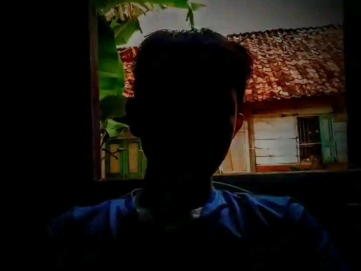

<!DOCTYPE html>
<html lang="en">
  <head>
    <meta charset="UTF-8">
    <meta name="viewport"
    content="width=device-widht, initial-scale=1.0">
    <title>button</title>
  </head>
  
  <body>
    <h1 style="text-align:center;">HELLO WORLD</h1>
   

   <button onclick="location.href='website.html'">CLICK</button>
   

    

    
My first experience with HTML and CSS was both exciting and challenging. I was thrilled to learn about the basic structure of a web page, including headings, paragraphs, images, and links, and how to style them with CSS. As I progressed, I discovered the power of CSS and how it could transform a plain HTML page into a beautiful and responsive website. With each problem I solved, I felt a sense of accomplishment and grew more confident in my abilities, and I knew that I was just scratching the surface of what was possible with web development.

    

    
As I continue to explore more advanced concepts like layouts, flexbox, and responsive design, I realize how much potential there is in front-end development. Building projects from scratch not only helps me understand the theory, but also gives me the confidence to face real-world challenges. I’m excited to keep learning, improve my skills, and one day create websites and apps that people all over the world can use and enjoy.

    

    
    

    
©2025:faizul ibnu:hak cipta 

  </body>
</html>
